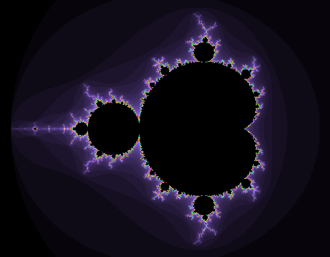

Samples
=======

Mandelbrot
----------

Visualising the Mandelbrot fractal with ``asq``. This is a direct translation
of Jon Skeet's original `LINQ Mandelbrot <http://msmvps.com/blogs/jon_skeet/arc
hive/2008/02/26/visualising-the-mandelbrot-set-with-linq-yet-again.aspx>`_
from LINQ in C# to ``asq`` in Python. The sample requires the `Python Imaging
Library <http://www.pythonware.com/products/pil/>`_ and so at the time of
writing only works with Python 2.

This example can be found in the source distribution of ``asq`` under
``examples/mandelbrot.py``.

.. literalinclude:: ../../examples/mandelbrot.py

This example can be be run with::

  python examples/mandelbrot.py

which produces

